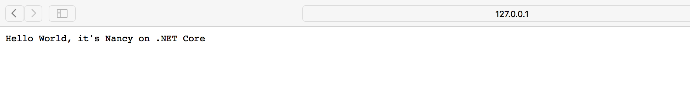

# WebApi Using Nancy on .net Core
  
  This is a demo of using Nancy on .net Core ,it's quite simple and easy ~ enjoy:)
  
# How to use

  make sure you have already installed .net core ,then change to directory of src ,run command 
  `
  dotnet run
  `
# Docker Run 
  * make sure you have already installed docker 
  * run the scripts of `scripts\build_webapi.sh` build the docker image 
  `
  sudo sh build_webapi.sh
  `
  * run the script of `scripts\deploy_webapi.sh`
   `
  sudo sh deploy_webapi.sh  
   `
  * the application will start now ,you can open it on you web browser 
    `http://127.0.0.1:5000`
    
    
  * if you want the json result ,please use the curl or request it just like this 
   `curl http://127.0.0.1:5000/person/game`
    
    then the result is: 
    ``
    {"name":"game"}
    ``